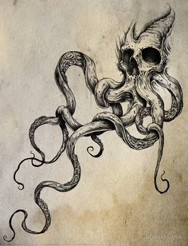

# myprofile
## Bio
---
---
My name is stephan kplin and i am soon to be a graduate of the yearup program project management course. I have a lot of intrest most of them are in the tech world and some are art based. I am really into tattoo art, espeically dark thin nihlistic style art. I also enjoy a little bit of gaming, not nearly as much as i di in my youth but i stil enjoy picking up the controller very once in a while. I just commited myself to a fitnes journey so that is taking up most of my time at the moment!
---
---
## My YearUp journey
Three things that have really  excited me about year up is the oppourtunity, i start internship at the end of this month and i couldent be more excited. I am also excited to be around alot of poeple that share my ethnicity it has really been nice being around people that look like me. Last but not least i am excited about everything that i have learned and i cant wait to apply it
---
---
## **Acomplishments** 
The thing im **MOST** proud of is obtaining my project management certificate before the deadline, i worked very hard and was proud of myself.
---
---
## A cool picture!
The picture below might not really describe me but this is the type of tattoos i was talking about when i said dark and thin lined. I actually want my friend to get this because he wants to go for a dark nautical theme for his tattoos.
---
---

*THAT'S ALL FOLKS*
😆

[My linkedin](https://www.linkedin.com/in/stephan-kplin-6a459620b/)
